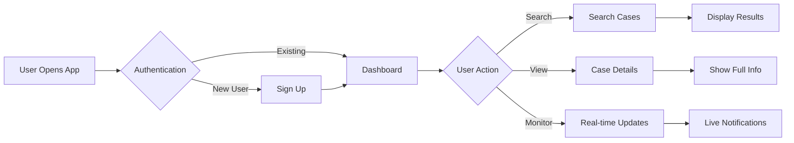
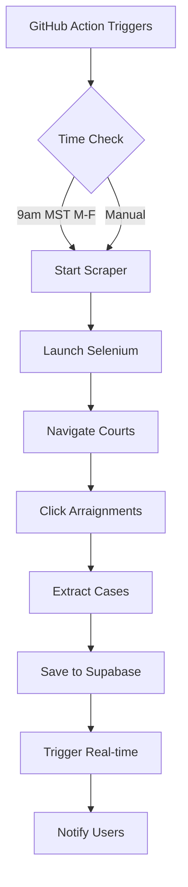
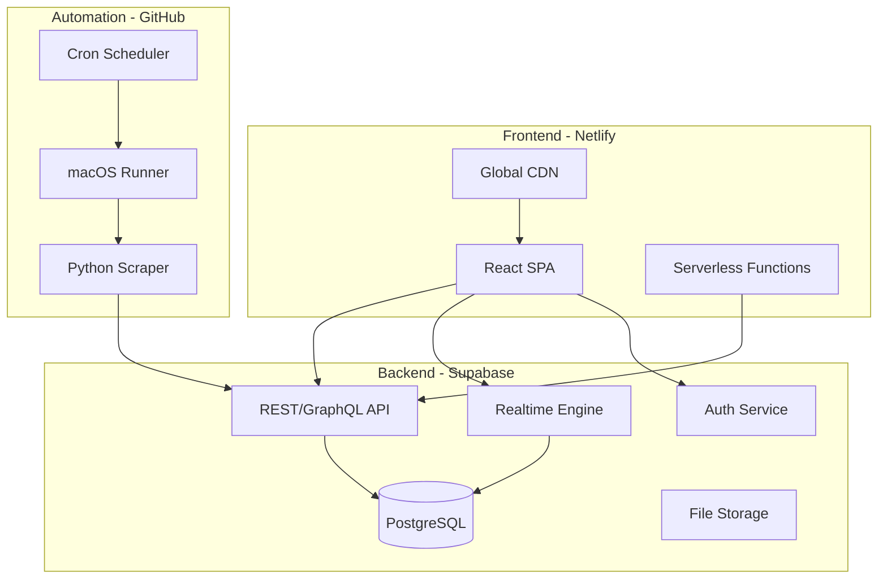
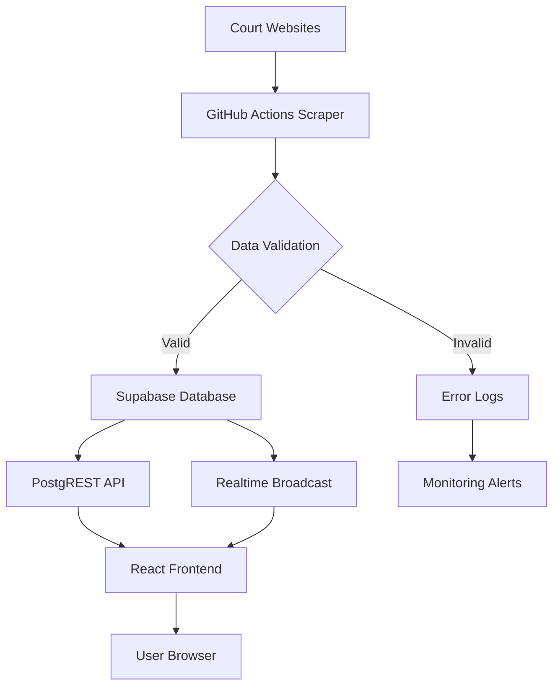
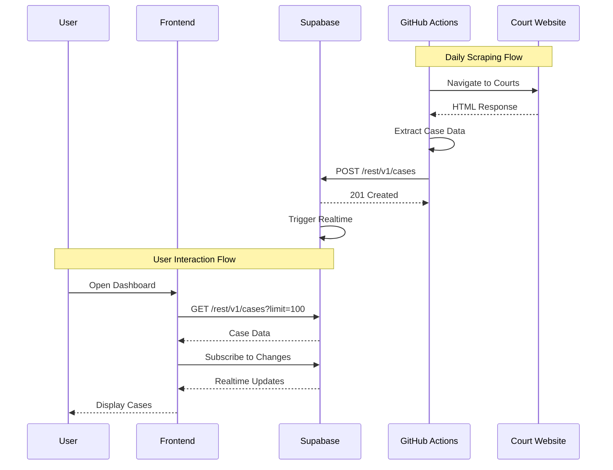
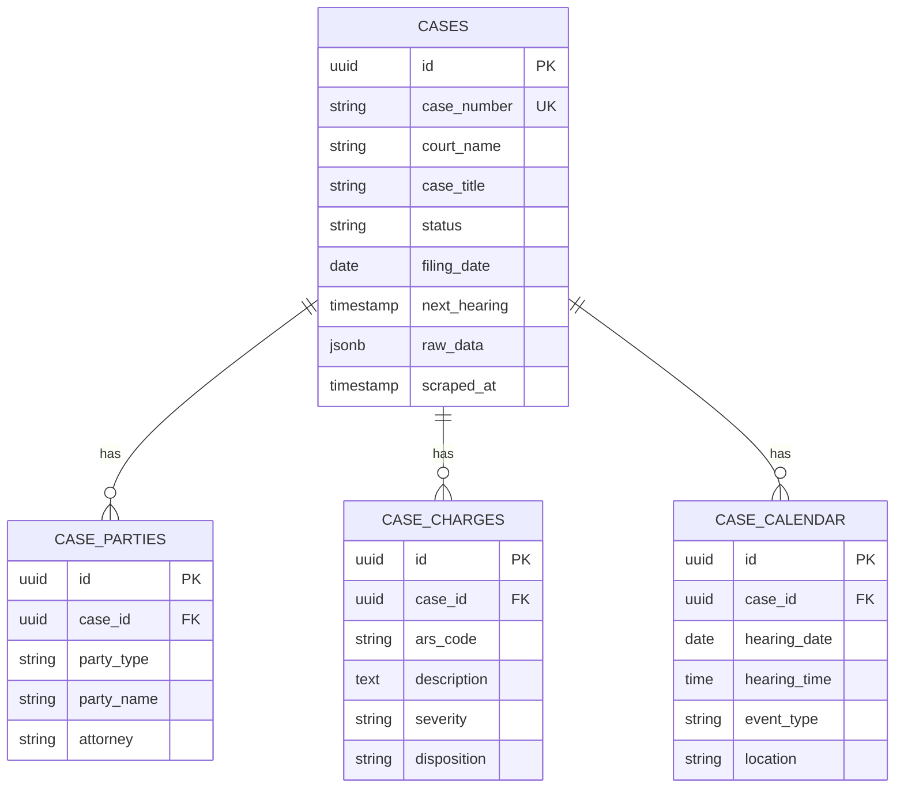
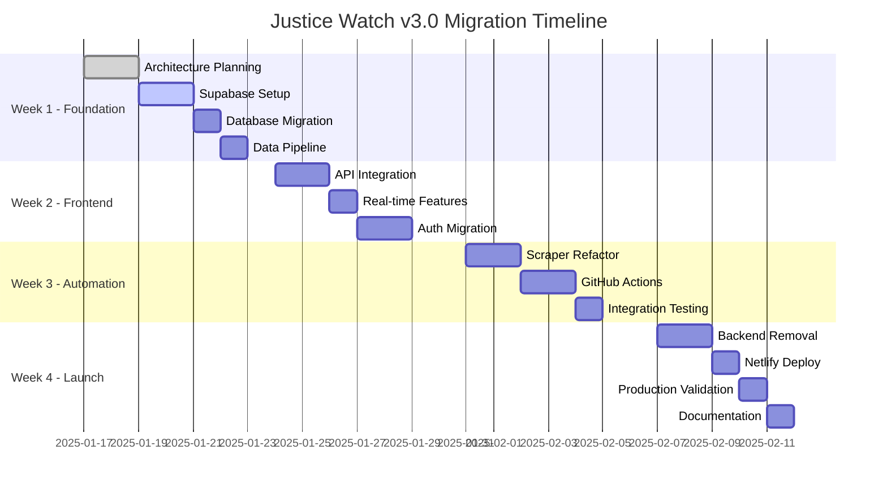
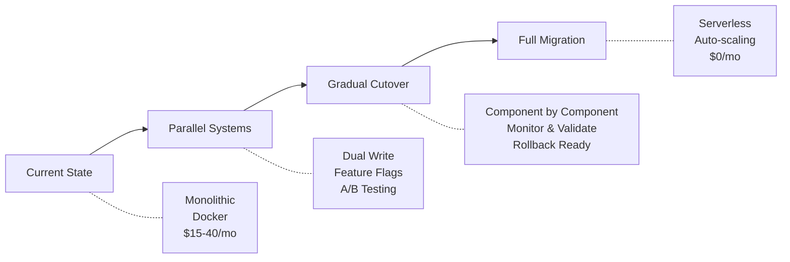
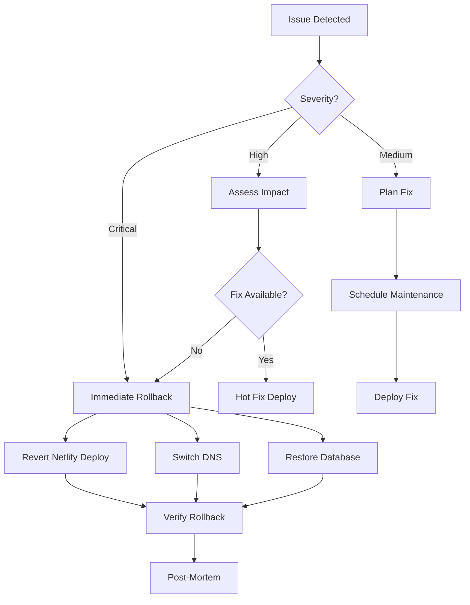

# Justice Watch v3.0 Serverless Architecture Planning PRP

## Executive Summary

### Problem Statement
Justice Watch currently runs on a monolithic Node.js/Docker architecture with monthly hosting costs of $15-40. The system requires complex deployment processes, has single points of failure, and lacks real-time capabilities. We need to modernize the infrastructure while eliminating hosting costs and improving scalability.

### Solution Overview
Transform Justice Watch into a serverless, event-driven architecture using:
- **Netlify**: Static site hosting with edge functions
- **Supabase**: PostgreSQL database with real-time subscriptions, auth, and APIs
- **GitHub Actions**: Automated scraping with macOS runners for anti-bot bypass
- **Cost**: $0/month using free tiers

### Success Metrics
- **Cost Reduction**: $0/month hosting (100% reduction)
- **Performance**: <2 second page loads (50% improvement)
- **Reliability**: 99.9% uptime with auto-scaling
- **Automation**: 100% hands-free daily scraping
- **Developer Experience**: Single-command deployments

---

## User Stories & Scenarios

### Primary User Flow


### Court Scraping Flow


### User Stories

1. **As a public defender**, I want to see today's arraignments instantly so that I can prepare for court
   - Acceptance Criteria:
     - [ ] Real-time updates when new cases appear
     - [ ] Filter by court location
     - [ ] Export to CSV for offline work
   - Edge Cases:
     - Court website is down
     - Duplicate case numbers
     - Mid-day case additions

2. **As a family member**, I want to search for a specific case so that I can track my loved one's proceedings
   - Acceptance Criteria:
     - [ ] Search by name or case number
     - [ ] View full case history
     - [ ] Get notifications on updates
   - Edge Cases:
     - Multiple cases for same person
     - Sealed/restricted cases
     - Name variations/typos

3. **As an administrator**, I want the system to run without intervention so that I don't need daily maintenance
   - Acceptance Criteria:
     - [ ] Automated daily scraping
     - [ ] Self-healing on failures
     - [ ] Alert only on critical issues
   - Edge Cases:
     - Website structure changes
     - Rate limiting
     - Authentication expiry

---

## System Architecture

### High-Level Architecture


### Data Flow Architecture


### Component Breakdown

**Frontend Components**:
- **Dashboard**: Real-time case statistics and recent updates
- **SearchInterface**: Advanced filtering and search capabilities
- **CaseViewer**: Detailed case information with timeline
- **NotificationCenter**: Real-time alerts and updates
- **ExportTools**: CSV/PDF generation for offline use

**Backend Services**:
- **Supabase Database**: PostgreSQL with RLS policies
- **Supabase Auth**: User authentication and role management
- **Supabase Realtime**: WebSocket subscriptions for live updates
- **PostgREST API**: Auto-generated REST endpoints
- **Edge Functions**: Serverless compute for complex operations

**Automation Services**:
- **GitHub Actions**: Scheduled workflow orchestration
- **Selenium Scraper**: Browser automation for court websites
- **Data Processor**: Case extraction and normalization
- **Error Handler**: Retry logic and failure recovery

---

## Technical Specifications

### API Design


### Database Schema


### API Endpoints

**Cases API**:
- **GET /rest/v1/cases**
  - Query params: `court_name`, `status`, `date_range`, `limit`, `offset`
  - Response: `{data: [{case}], count: number}`
  
- **GET /rest/v1/cases/:case_number**
  - Response: Full case with related parties, charges, calendar
  
- **POST /rest/v1/rpc/search_cases**
  - Request: `{query: string, filters: {...}}`
  - Response: Ranked search results

**Real-time Subscriptions**:
```javascript
// Subscribe to new cases
supabase
  .channel('cases_channel')
  .on('postgres_changes', {
    event: 'INSERT',
    schema: 'public',
    table: 'cases'
  }, handleNewCase)
  .subscribe()

// Subscribe to case updates
supabase
  .channel('case_updates')
  .on('postgres_changes', {
    event: 'UPDATE',
    schema: 'public',
    table: 'cases',
    filter: `case_number=eq.${caseNumber}`
  }, handleCaseUpdate)
  .subscribe()
```

### Scraper Specifications

**Click-Based Navigation (CRITICAL)**:
```python
# NEVER construct URLs - always use click navigation
class MaricopaScraper:
    def navigate_to_arraignments(self):
        # Click through the court interface
        self.click_element("//a[text()='Court Cases']")
        self.click_element("//button[text()='Criminal']")
        self.click_element("//a[contains(text(),'Arraignment')]")
        
    def discover_courts(self):
        # Dynamically find all court locations
        court_elements = self.find_elements("//div[@class='court-location']")
        for court in court_elements:
            court.click()
            self.extract_cases()
            self.go_back()
```

---

## Implementation Strategy

### Development Phases


### Migration Strategy


### Implementation Priority

1. **Foundation** (Days 1-5)
   - Set up Supabase project and schema
   - Create database migration scripts
   - Establish API connections
   - Configure authentication

2. **MVP Features** (Days 6-10)
   - Basic case display and search
   - API integration layer
   - Simple authentication flow
   - Manual scraper trigger

3. **Enhanced Features** (Days 11-15)
   - Real-time subscriptions
   - Advanced search filters
   - Automated scraping
   - Error recovery

4. **Polish** (Days 16-18)
   - Performance optimization
   - UI/UX improvements
   - Comprehensive error handling
   - Monitoring setup

5. **Production Ready** (Days 19-21)
   - Full testing suite
   - Documentation
   - Deployment automation
   - Handoff preparation

---

## Risk Analysis & Mitigation

### Technical Risks
```yaml
performance_risks:
  - risk: "Supabase query performance at scale"
    probability: Medium
    impact: High
    mitigation: 
      - "Implement proper indexes"
      - "Use materialized views for complex queries"
      - "Add Redis caching layer if needed"
    
  - risk: "GitHub Actions runner limits"
    probability: Low
    impact: Medium
    mitigation:
      - "Monitor usage closely"
      - "Optimize scraper efficiency"
      - "Prepare self-hosted runner backup"

security_risks:
  - risk: "Exposed API keys in frontend"
    probability: Low
    impact: Critical
    mitigation:
      - "Use only anon keys in frontend"
      - "Implement RLS policies"
      - "Regular security audits"

reliability_risks:
  - risk: "Court website structure changes"
    probability: High
    impact: High
    mitigation:
      - "Robust error handling"
      - "Multiple selector strategies"
      - "Alert on scraping failures"
      - "Manual fallback process"
```

### Business Risks
```yaml
adoption_risks:
  - risk: "User resistance to new interface"
    probability: Medium
    impact: Medium
    mitigation:
      - "Maintain familiar UI patterns"
      - "Provide training materials"
      - "Gradual rollout with feedback"

operational_risks:
  - risk: "Free tier limits exceeded"
    probability: Low
    impact: Low
    mitigation:
      - "Daily usage monitoring"
      - "Alerts at 80% capacity"
      - "Quick upgrade path ready"

compliance_risks:
  - risk: "Data privacy concerns"
    probability: Low
    impact: High
    mitigation:
      - "Follow existing data policies"
      - "Implement audit logging"
      - "Regular compliance reviews"
```

### Edge Cases & Handling

```markdown
## Edge Case Scenarios

### Scraping Edge Cases
1. **Court website maintenance**
   - Detection: HTTP 503 or maintenance page detected
   - Handling: Skip scraping, retry in 1 hour, alert if >6 hours
   
2. **Anti-bot detection triggered**
   - Detection: Captcha or rate limit response
   - Handling: Slow down requests, rotate user agents, use residential proxy
   
3. **Duplicate case numbers**
   - Detection: Unique constraint violation
   - Handling: Update existing record, log anomaly

### User Experience Edge Cases
1. **Offline user accessing app**
   - Detection: No network connectivity
   - Handling: Show cached data, queue actions for sync
   
2. **Concurrent case updates**
   - Detection: Version mismatch on update
   - Handling: Optimistic locking, show conflict resolution UI
   
3. **Search with 10k+ results**
   - Detection: Result count exceeds threshold
   - Handling: Force pagination, suggest filters, limit initial load

### System Edge Cases
1. **Supabase outage**
   - Detection: API timeout or 5xx errors
   - Handling: Fallback to cached data, show status banner
   
2. **GitHub Actions quota exceeded**
   - Detection: Workflow fails with quota error
   - Handling: Alert admin, provide manual scraping instructions
   
3. **Netlify build failures**
   - Detection: Deploy webhook reports failure
   - Handling: Rollback to previous version, alert dev team
```

---

## Success Criteria

### Definition of Done
- [ ] All 11 PRPs completed and validated
- [ ] Zero hosting costs achieved
- [ ] All existing features preserved
- [ ] Performance targets met (<2s load)
- [ ] Automated scraping operational
- [ ] Real-time updates functional
- [ ] Test coverage >80%
- [ ] Documentation complete
- [ ] Production deployment successful
- [ ] Monitoring and alerts configured

### Measurable Outcomes

| Metric | Current | Target | Method |
|--------|---------|--------|--------|
| Monthly Cost | $15-40 | $0 | Billing statements |
| Page Load Time | 3-4s | <2s | Lighthouse scores |
| Uptime | 95% | 99.9% | Uptime monitoring |
| Deployment Time | 30 min | 5 min | CI/CD metrics |
| Scraping Success | 80% | 95% | Success/failure logs |
| User Satisfaction | Unknown | >4.0/5 | User surveys |
| Test Coverage | 40% | 80% | Coverage reports |
| API Response Time | 500ms | 200ms | Performance monitoring |

### Validation Gates

```bash
# Level 1: Code Quality
npm run lint && npm run type-check
python -m flake8 scrapers/ && python -m mypy scrapers/

# Level 2: Unit Tests
npm run test -- --coverage
pytest scrapers/tests/ -v --cov=scrapers

# Level 3: Integration Tests
npm run test:integration
python test_supabase_integration.py

# Level 4: End-to-End Tests
npm run test:e2e
python test_scraping_flow.py

# Level 5: Performance Tests
npm run test:performance
ab -n 1000 -c 10 https://justice-watch.netlify.app/api/cases

# Level 6: Production Smoke Tests
curl https://justice-watch.netlify.app/health
python verify_production_scraping.py
```

---

## Rollback Strategy

### Rollback Triggers
1. Critical bug in production
2. Data corruption detected
3. Performance degradation >50%
4. Security vulnerability discovered
5. User complaints >10% of active users

### Rollback Procedures


### Recovery Time Objectives
- **Critical Issues**: <15 minutes rollback
- **High Priority**: <1 hour resolution
- **Medium Priority**: <4 hours resolution
- **Low Priority**: Next scheduled release

---

## Implementation Checklist

### Week 1 Checklist
- [ ] Complete architecture documentation
- [ ] Create Supabase project
- [ ] Set up database schema
- [ ] Configure RLS policies
- [ ] Create API functions
- [ ] Test database connections
- [ ] Build data migration scripts
- [ ] Verify data integrity

### Week 2 Checklist
- [ ] Create Supabase service layer
- [ ] Implement parallel API calls
- [ ] Add feature flags
- [ ] Set up real-time subscriptions
- [ ] Migrate authentication
- [ ] Update React components
- [ ] Test frontend integration
- [ ] Verify real-time updates

### Week 3 Checklist
- [ ] Refactor Python scrapers
- [ ] Create GitHub workflows
- [ ] Configure secrets
- [ ] Test scraping automation
- [ ] Implement error handling
- [ ] Add monitoring
- [ ] Run integration tests
- [ ] Validate data flow

### Week 4 Checklist
- [ ] Remove old backend code
- [ ] Clean up dependencies
- [ ] Configure Netlify
- [ ] Deploy to production
- [ ] Run smoke tests
- [ ] Update documentation
- [ ] Configure monitoring
- [ ] Team handoff

---

## Appendices

### A. Technology Decisions

| Decision | Choice | Rationale |
|----------|--------|-----------|
| Database | Supabase | Free tier, real-time, built-in auth |
| Frontend Host | Netlify | Free static hosting, edge functions |
| Scraper Host | GitHub Actions | Free Mac runners, cron scheduling |
| Frontend Framework | React (existing) | Preserve working code |
| Scraper Language | Python (existing) | Proven Selenium scripts |
| API Style | REST + Real-time | Simplicity + live updates |

### B. Cost Breakdown

```markdown
## Current Costs (Monthly)
- VPS Hosting: $10-20
- Database: $5-10
- Redis: $5
- Monitoring: $5
- **Total: $25-40/month ($300-480/year)**

## New Costs (Monthly)
- Netlify Free: $0 (100GB bandwidth included)
- Supabase Free: $0 (500MB storage, 2GB bandwidth)
- GitHub Actions Free: $0 (2000 minutes/month)
- **Total: $0/month ($0/year)**

## When to Consider Paid Tiers
- Netlify Pro ($19/mo): >100GB bandwidth or >100K requests
- Supabase Pro ($25/mo): >500MB storage or >50K MAU
- GitHub Team ($4/user/mo): Private repos need >2000 minutes
```

### C. Migration Validation Script

```python
# validate_migration.py
import sys
from datetime import datetime, timedelta

def validate_migration():
    checks = []
    
    # Check 1: Database connectivity
    checks.append(test_supabase_connection())
    
    # Check 2: API endpoints
    checks.append(test_api_endpoints())
    
    # Check 3: Real-time subscriptions
    checks.append(test_realtime())
    
    # Check 4: Scraper functionality
    checks.append(test_scraper())
    
    # Check 5: Frontend deployment
    checks.append(test_netlify_deployment())
    
    # Check 6: Performance benchmarks
    checks.append(test_performance())
    
    # Generate report
    passed = sum(1 for c in checks if c['passed'])
    total = len(checks)
    
    print(f"\nMigration Validation Report")
    print(f"{'='*40}")
    print(f"Date: {datetime.now().isoformat()}")
    print(f"Result: {passed}/{total} checks passed")
    print(f"Status: {'✅ READY' if passed == total else '❌ NOT READY'}")
    
    for check in checks:
        status = '✅' if check['passed'] else '❌'
        print(f"{status} {check['name']}: {check['message']}")
    
    return passed == total

if __name__ == "__main__":
    if not validate_migration():
        sys.exit(1)
```

---

## Document Metadata

- **Version**: 1.0.0
- **Created**: 2025-01-17
- **Last Updated**: 2025-01-17
- **Author**: Justice Watch Development Team
- **Status**: Ready for Review
- **Next Review**: After Supabase setup completion

---

## Sign-off

| Role | Name | Date | Signature |
|------|------|------|-----------|
| Technical Lead | _______ | _______ | _______ |
| Product Owner | _______ | _______ | _______ |
| DevOps Lead | _______ | _______ | _______ |
| QA Lead | _______ | _______ | _______ |

---

*This document serves as the comprehensive architectural blueprint for the Justice Watch v3.0 migration. It should be reviewed and updated as the implementation progresses.*