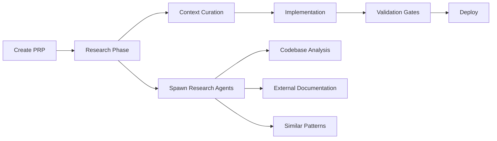

# PRP-Based Application Transformation: Justice Watch AZ

## Executive Summary

This document **supersedes** previous transformation plans (`application-transformation.md`, `refactor.md`) by applying the PRP (Product Requirement Prompt) Framework methodology for rapid, iterative delivery.

**Key Change**: Instead of a 10-week waterfall approach, we deliver value in 3 one-week sprints using validated, context-rich PRPs.

## Current State Analysis

### What Works (Canon Code)
- **Scraper**: Functional but inefficient (663-line monolith with hardcoded delays)
- **Frontend**: Clean React/TypeScript dashboard displaying cases
- **Backend**: Express API with Supabase integration and Socket.io
- **Deployment**: Working Akash configuration (AIO.23 Docker image)

### What Needs Improvement
- **Performance**: Scraper takes ~30s per case (should be 3-5s)
- **Data Depth**: Missing charges, parties, documents, financial info
- **UI/UX**: No search, filters, or visualizations
- **Architecture**: No separation between scraper and app

### Code Classification

#### Keep as Canon (Working Foundation)
```
justice-watch-app/
├── server/
│   ├── index.js                 # Socket.io setup, core Express config
│   ├── routes/scraping.js       # Scraping orchestration patterns
│   └── routes/cases.js          # API response structures
├── src/
│   ├── components/CasesDashboard.tsx  # React patterns, component structure
│   └── services/api.ts              # API client patterns
└── database/schema_no_auth.sql      # Current Supabase schema
```

#### Extract as Examples (For PRP Context)
- Current case data structure from `CasesDashboard.tsx`
- Scraper's court discovery logic (lines 50-100 of scraper)
- Export functionality (CSV/PDF generation in Dashboard)
- Socket.io real-time update pattern

#### Mark for Refactor (Inefficient but Functional)
- `scrapers/maricopa_arraignment_scraper.py` - entire file needs modularization
- Hardcoded `time.sleep()` calls (8 instances)
- Sequential court processing loop
- No caching or connection pooling

## PRP-Optimized Transformation Plan

### Core Principle: Value-First Iteration
Each sprint delivers user-visible value while building toward the complete vision.

## Sprint 1: "Quick Value" (Week 1)
**Objective**: Enhance what's working without breaking anything

### Day 1-2: Frontend Enhancement
**PRP**: `PRPs/justice-watch/ui-quick-enhancements.md`
```yaml
Type: Task PRP
Command: /prp-task-create
Deliverables:
  - Search bar for case numbers, names, courts
  - Basic charts (cases by court, hearing timeline)
  - Mobile responsive improvements
  - "Last updated" timestamp display
Context:
  Canon: src/components/CasesDashboard.tsx
  Libraries: Already has recharts, keep using it
  Validation: npm run build && npm test
```

### Day 3: Scraper Performance
**PRP**: `PRPs/justice-watch/scraper-performance-quick-fix.md`
```yaml
Type: Task PRP
Command: /prp-task-create
Deliverables:
  - Replace time.sleep() with WebDriverWait
  - Add retry logic with exponential backoff
  - Basic error recovery
Context:
  Canon: Keep monolithic structure for now
  Pattern: WebDriverWait(driver, 10).until(EC.element_to_be_clickable())
  Validation: python scrapers/test_performance.py
```

### Day 4-5: Add Cron Scheduling
**PRP**: `PRPs/justice-watch/add-cron-scheduler.md`
```yaml
Type: Feature PRP
Command: /prp-base-create
Deliverables:
  - node-cron integration in Express
  - Schedule scraper every 6 hours
  - Update last_scraped timestamp
Context:
  Canon: server/routes/scraping.js endpoints
  New: node-cron package
  Validation: Check cron logs, verify timestamp updates
```

**Sprint 1 Success Metrics**:
- ✓ Users can search/filter cases
- ✓ Visual charts showing court distribution
- ✓ Scraper runs 5-10x faster
- ✓ Automatic updates every 6 hours

## Sprint 2: "Data Enrichment" (Week 2)
**Objective**: Capture comprehensive case data

### Day 1-3: Enhanced Data Model
**PRP**: `PRPs/justice-watch/enhanced-data-capture.md`
```yaml
Type: Feature PRP
Command: /prp-base-create with research agents
Deliverables:
  - Capture charges with ARS codes
  - Extract party information (plaintiff/defendant)
  - Collect case documents list
  - Financial information (bail, fines)
Context:
  Research: Spawn agents to analyze court HTML structures
  Schema: Extend existing JSONB fields incrementally
  Backward Compatible: Don't break existing data
  Validation: Data completeness >90%
```

### Day 4-5: API Enhancement
**PRP**: `PRPs/justice-watch/api-graphql-cache.md`
```yaml
Type: Feature PRP
Command: /prp-base-create
Deliverables:
  - GraphQL layer alongside REST
  - Redis caching with 5min TTL
  - Aggregate statistics endpoints
Context:
  Canon: Keep existing REST endpoints
  New: Apollo Server Express
  Cache: Redis for hot data
  Validation: GraphQL playground, cache hit rates
```

**Sprint 2 Success Metrics**:
- ✓ 90%+ data field completion
- ✓ Sub-200ms API response times
- ✓ Rich case details available

## Sprint 3: "Scale & Polish" (Week 3)
**Objective**: Production-ready architecture

### Day 1-3: Scraper Modularization
**PRP**: `PRPs/justice-watch/scraper-modular-refactor.md`
```yaml
Type: Planning PRP with Refactor
Command: /prp-planning-create then /refactor-simple
Deliverables:
  - Strategy pattern for extraction
  - Parallel court processing
  - Driver connection pooling
  - Separate cron service
Architecture:
  scrapers/
  ├── core/
  │   ├── driver_manager.py
  │   ├── navigator.py
  │   └── extractor.py
  ├── strategies/
  │   ├── table_strategy.py
  │   └── text_strategy.py
  └── maricopa_scraper.py (orchestrator)
Validation: Parallel execution test, memory usage
```

### Day 4-5: Embeddable Widgets
**PRP**: `PRPs/justice-watch/embeddable-widgets.md`
```yaml
Type: Feature PRP
Command: /prp-base-create
Deliverables:
  - iframe-friendly components
  - Multiple widget sizes
  - Customization parameters
  - CORS/CSP headers
Context:
  Widgets:
    - Full dashboard
    - Stats only
    - Today's hearings
    - Search interface
  Security: Proper X-Frame-Options
  Validation: Test embedding in external site
```

**Sprint 3 Success Metrics**:
- ✓ Process 26 courts in <5 minutes
- ✓ Embeddable widgets working
- ✓ 99%+ uptime capability

## Implementation Patterns

### PRP Execution Flow


### Validation Gate Hierarchy
```bash
# Level 1: Syntax/Lint (Every PRP)
npm run lint && npm run typecheck
python -m pylint scrapers/

# Level 2: Unit Tests (Feature PRPs)
npm test
pytest tests/

# Level 3: Integration (Feature PRPs)
npm run dev & curl http://localhost:3001/api/health

# Level 4: E2E (Sprint completion)
npm run e2e
```

## Migration from Previous Plans

### What We're Keeping
- Enhanced data model structure (from `application-transformation.md`)
- Modular scraper architecture (from `refactor.md`)
- Deployment strategy on Akash

### What We're Changing
- **Timeline**: 3 weeks instead of 10
- **Approach**: Iterative sprints vs waterfall phases
- **Validation**: Built-in gates at every step
- **Context**: PRPs contain all needed information

### What We're Adding
- PRP-driven development with validation
- Parallel research agent utilization
- Incremental value delivery
- Existing code as canon reference

## Risk Mitigation

### Technical Risks
| Risk | Mitigation | PRP Approach |
|------|------------|--------------|
| Court site changes | Modular parsers | Strategy pattern in PRPs |
| Scraping blocks | Rate limiting | Built into performance PRP |
| Data inconsistency | Validation layer | Each PRP has quality gates |
| Performance issues | Caching/pooling | Addressed in each sprint |

### Process Risks
| Risk | Mitigation | PRP Approach |
|------|------------|--------------|
| Incomplete context | Research agents | /prp-base-create spawns agents |
| Breaking changes | Canon code refs | PRPs reference working code |
| Validation gaps | Gate hierarchy | Every PRP has 4 levels |

## Success Metrics

### Sprint Velocity
- Sprint 1: 3 PRPs, 5 days
- Sprint 2: 2 PRPs, 5 days (more complex)
- Sprint 3: 2 PRPs, 5 days (architecture)

### Quality Metrics
- PRP validation pass rate: >95%
- One-pass implementation: >90%
- Test coverage increase: >80%

### Business Metrics
- Day 3: First user-visible improvement
- Week 1: 5-10x performance gain
- Week 2: 90% data completeness
- Week 3: Production-ready system

## Appendix: PRP Templates to Use

### Quick Tasks (1-2 days)
Use: `/prp-task-create`
- UI enhancements
- Performance fixes
- Small features

### Complex Features (3-5 days)
Use: `/prp-base-create`
- Data model changes
- New API endpoints
- Architecture components

### Planning & Architecture
Use: `/prp-planning-create`
- System design
- Refactoring plans
- Module architecture

### Parallel Development
Use: `/prp-parallel-create`
- Multiple related PRPs
- Sprint planning
- Batch improvements

## Next Steps

1. **Immediate**: Create Sprint 1 PRPs using this plan
2. **Day 1**: Start with UI enhancements (biggest visible impact)
3. **Continuous**: Run validation gates after each PRP
4. **Weekly**: Sprint review and next sprint planning

This plan delivers the same end goal as the original 10-week plan but with:
- **Faster value delivery** (days not weeks)
- **Lower risk** (incremental changes)
- **Better validation** (PRP gates)
- **Richer context** (research agents)

Ready to start Sprint 1 with `/prp-task-create "UI Quick Enhancements"`.